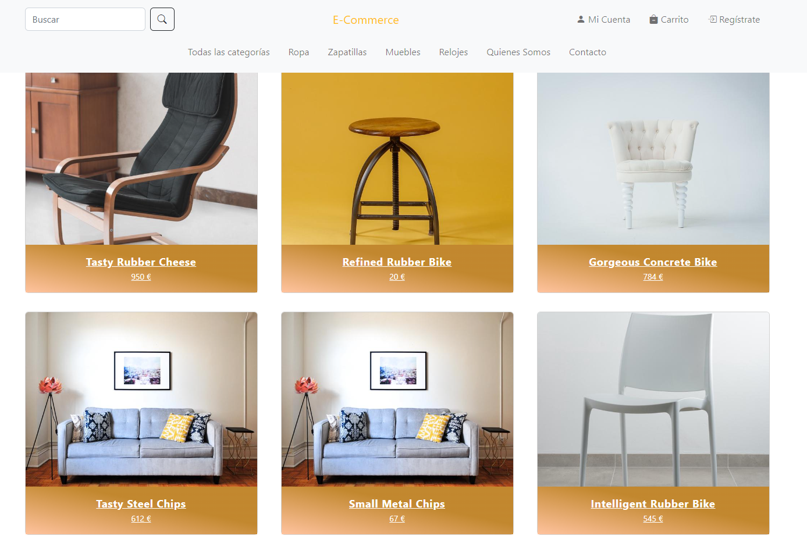
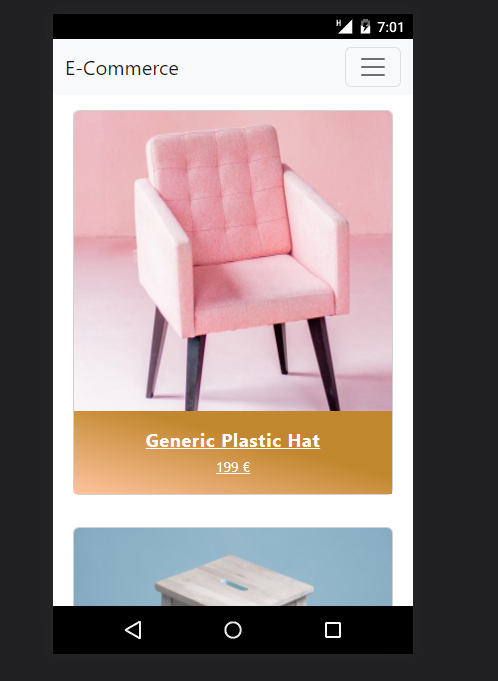
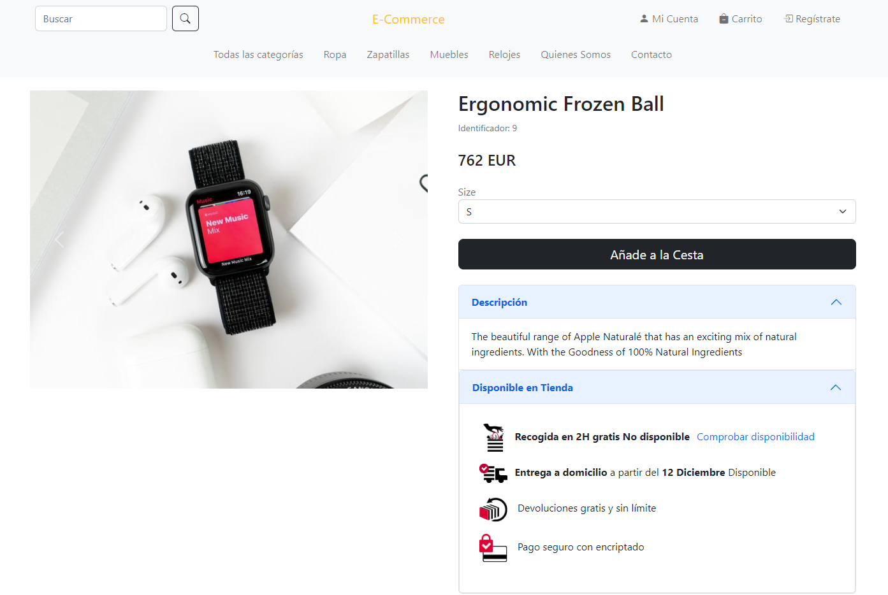
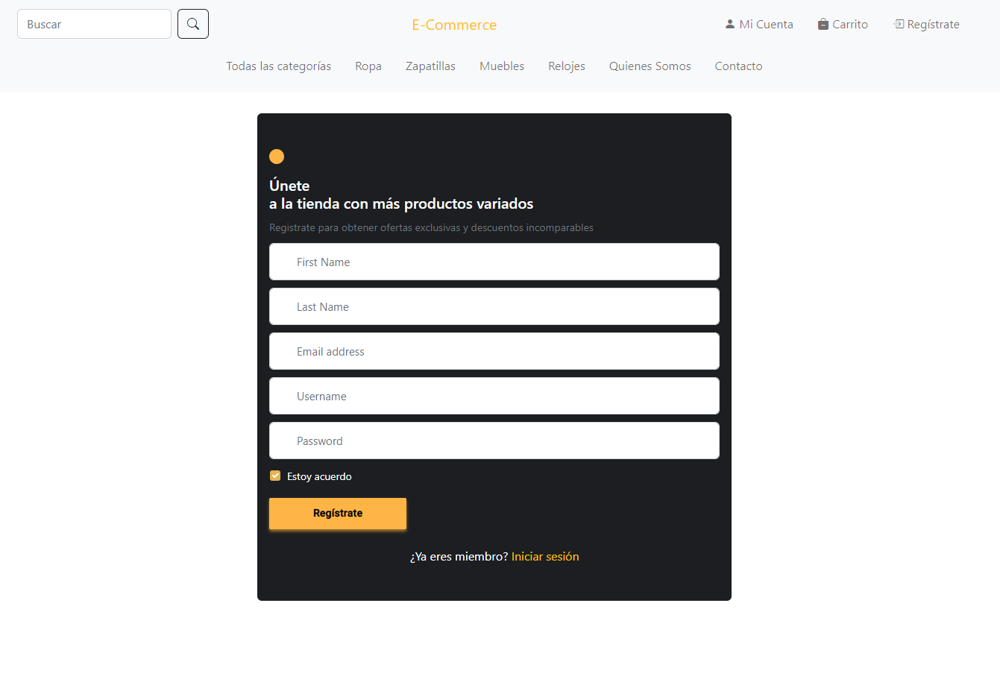
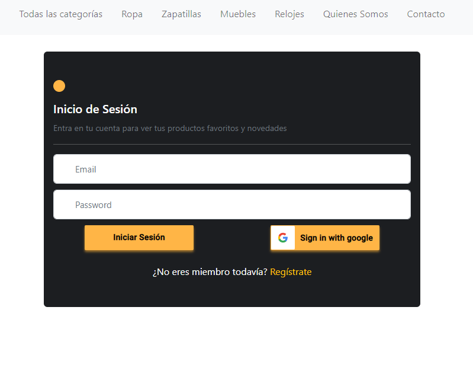

# Angular-15 - Ecommerce + Bootstrap + Firebase (Realtime Database) + Public API + AWS

This project was generated with [Angular CLI](https://github.com/angular/angular-cli) version 15.0.2.

Developing a **ShoppingCart (Ecommerce) Application using Angular-10**.

**Live Demo** : [Angular-shopping-cart](https://master.d12v1sc53xxq50.amplifyapp.com/categories)

It's deployed on amazon web service (AWS)


## Functionalities

1.  User Registration using Firebase Authentication (using Email/Password | Google Authentication )
- Allows you to log in and log out
2. Query data to a public API
- User can browse through all categories and products.
- User can view the details of the selected product.
3.  Security

- Implmented Authentication and Authorization

4. Responsive


## Tools and Technologies
 
 
 
 

 
 
 
 


 


#### This Projects covers all fundamentals of Angular

- Multiple Modules
- Components, Template and DataBinding
- Form Validation
- HttpClient
- Animations
- Dependency Injection
- Routing & Navigation
- Route Guards
- Service Workers


## Install

1.  Angular CLI
    - [Download Angular CLI](https://cli.angular.io/)
2.  NodeJs
    - [Download Nodejs](https://nodejs.org/en/download/)
3.  Package Manager - NPM / Yarn
4.  Clone the repository and run `npm install` if you use **npm** as package manager 

5.  Angular + Firebase Tutorial - [Angular + Firebase + Typescript — Step by step tutorial](https://medium.com/factory-mind/angular-firebase-typescript-step-by-step-tutorial-2ef887fc7d71)
6.  Activate Firebase Authentication Providers

    `Authentication -> Sign-in-method -> Enable Email/Password & Google provider`
7.  Configure your firebase configuration `src/environments/environment.ts`

    ```
    export const FireBaseConfig = {
        apiKey: "YOUR_API_KEY",
        authDomain: "YOUR_AUTH_DOMAIN",
        databaseURL: "YOUR_DATABASE_URL",
        projectId: "YOUR_PROJECT_ID",
        storageBucket: "YOUR_STORAGE_BUCKET",
        messagingSenderId: "YOUR_SENDER_ID"
    };
## Screenshots of project
### Home page

### Home responsive


### Product detail:

### Log up:

### Log in:


## Things to implement or improve:
- Validation of form
- Add products to cart
- Display user information 
- CRUD to api 
- Price filter and search engine
- Pagination


## Running unit tests

Run `ng test` to execute the unit tests via [Karma](https://karma-runner.github.io).

## Running end-to-end tests

Run `ng e2e` to execute the end-to-end tests via a platform of your choice. To use this command, you need to first add a package that implements end-to-end testing capabilities.

## Further help

To get more help on the Angular CLI use `ng help` or go check out the [Angular CLI Overview and Command Reference](https://angular.io/cli) page.
## Development server

Run `ng serve` for a dev server. Navigate to `http://localhost:4200/`. The application will automatically reload if you change any of the source files.

## Author ✒️

-   [adria-vidal](https://github.com/adria-vidal)
-  [Linkedin](https://www.linkedin.com/in/adri%C3%A0-vidal/)
-  adriavidal.develop@gmail.com


